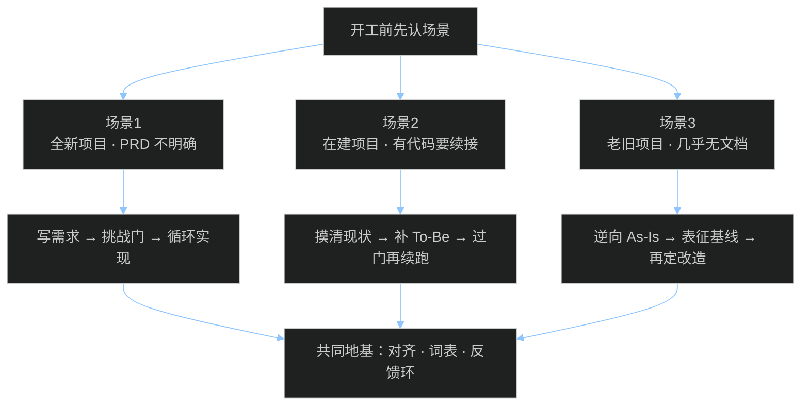

# 一期大纲 · 三个真实开工场景

> 这期是场景分享加讨论，不是背技能名。  
> 顺着问：手头什么状态，最容易踩什么坑，这套方法怎么接，现场讨论什么。

## 分享逻辑

---

## 开场：先认场景，再谈提效

翻车多半不怪模型不够聪明，更常见的是开工方式不对：

- 需求还糊着，就丢给 AI 写代码  
- 明明有存量代码，却当白板重写  
- 老系统没文档，却以为「读一遍就能改」

今天用三个开工场景，把各自该怎么起手说清楚。

---

## 场景 1：全新项目，PRD 还不明确

### 手头状态

- 有想法、口头需求，或一页粗糙说明  
- 还没有能让 AI 直接落地的模块化 PRD  
- 仓库可能是空的，也可能只有脚手架

### 常见错误

1. 「帮我把这个功能全做完」：范围膨胀，做出来的也不是你想要的  
2. 一口气写超长 PRD，不经挑战就开写：歧义直接进代码  
3. 项目里没有共同说法：AI 说话又长又飘

### 推荐路径

| 步骤 | 做什么 | 关键产物 |
| ---- | ------ | -------- |
| 1 | 拷问并对齐（含领域词） | `CONTEXT.md`、关键决策 |
| 2 | 合成模块化需求 | `docs/prd/00-macro-shared.md` + `modules/` |
| 3 | 成品挑战（挑战门） | `grill-signoff.md` = approved |
| 4 | 拆任务，小步实现 | 计划勾选 + 测试先行 |

编排入口：`/prd-author` → `/prd-grill` → `/prd-build-loop`  
底下靠拷问原语、领域建模、写成规格、测试驱动撑着。

### 讨论题

- 你最近一个很新的需求，卡在哪一层：目标、边界，还是验收？  
- 如果只能多做一件事再让 AI 写码，你选拷问对齐，还是先写测试？为什么？

---

## 场景 2：在建项目，已有部分功能与存量代码

### 手头状态

- 已经开发过一部分功能  
- 有存量代码，可能还有零散文档或半成品 PRD  
- 目标是续接：补功能、改行为、扩模块，不是从零重做

### 常见错误

1. 假装白板，让 AI「按新需求重写」：踩坏已上线行为  
2. 只补几句新需求就开写：新旧边界对不齐  
3. 没有「已实现 / 未实现」清单：重复造轮子，或该改的漏改

### 推荐路径

| 步骤 | 做什么 | 关键产物 |
| ---- | ------ | -------- |
| 1 | 摸清现状：哪些已交付、哪些半成品、代码落在哪 | 现状对照表（可局部 As-Is） |
| 2 | 对已有行为钉住反馈（表征测试，或关键路径手测清单） | 不敢轻易改坏的安全网 |
| 3 | 只为下一批变更写清 To-Be（缺口 + 范围） | 模块化 To-Be / 续接计划 |
| 4 | 挑战门通过后，再进循环实现 | `grill-signoff` + 续跑 |

补几句容易漏掉的：

- 续接不必做全量逆向，但改到的边界一定要说清。  
- 有文档就拿文档对代码；对不上的，以代码和测试为准，并记进「未知清单」。  
- 对齐、词表、小步、移交这些纪律，在续接里同样管用。

### 讨论题

- 在建项目里，「文档说有、代码没有」或反过来，你们最近一次是怎么发现的？  
- 续接时你更怕改坏旧功能，还是新功能接不上？各自该先补什么产物？

---

## 场景 3：老旧项目改造，缺需求、缺文档

### 手头状态

- 历史系统要重构、迁移或大改  
- 几乎没有可靠的需求说明和文档  
- 行为主要活在代码和人口口相传里

### 常见错误

1. 直接让 AI「重构整个项目」：行为漂移，线上出事  
2. 把逆向出来的 As-Is 直接当实现 backlog：把「现状」当成「目标」  
3. 不做忠实度确认就开改：改完才发现漏了暗逻辑

### 推荐路径

| 步骤 | 做什么 | 关键产物 |
| ---- | ------ | -------- |
| 1 | 代码考古 + 逆向 | `docs/prd/as-is/`（系统图、模块、债务、未知） |
| 2 | 忠实度签核 | `reverse-signoff.md` |
| 3 | 表征基线（把关键行为钉成测试或清单） | 改造安全网 |
| 4 | 再写 To-Be / 迁移计划（写目标态，不写现状复述） | 改造 backlog |
| 5 | 挑战门 → 循环实现 | 与新品后半段汇合 |

编排入口：`/prd-reverse` →（表征）→ To-Be → `/prd-grill` → `/prd-build-loop`  
硬规矩：只有 As-Is，不能进 build-loop。

### 讨论题

- 没有文档时，你更信老员工口述、生产日志，还是代码本身？怎么交叉验证？  
- 「先表征再改造」是不是太慢？慢在哪，省在哪？

---

## 三条路径对照

| | 场景 1 新品 | 场景 2 续接 | 场景 3 老改 |
| - | ----------- | ----------- | ----------- |
| 起点 | 模糊想法 | 半成品 + 代码 | 几乎只有代码 |
| 先产出 | 模块化 To-Be PRD | 现状对照 + 下一批 To-Be | As-Is + 忠实度 |
| 过门 | 挑战门 | 挑战门（针对变更） | 逆向签核 + 挑战门 |
| 禁忌 | 跳过对齐直接写码 | 当白板重写 | 把 As-Is 当 backlog |
| 终点 | build-loop | build-loop 续跑 | build-loop（按迁移切片） |

---

## 共同地基（只讲够用的）

三条路底下，其实就这几条纪律：

1. **先对齐，再动手**（拷问）  
2. **项目要有共同黑话**（领域词表）  
3. **反馈环决定你敢开多快**（测试驱动 / 表征）  
4. **小技能组合，决策归人**（过门要人确认）

Matt 那套提供地基；我们仓库按场景提供编排入口。

---

## 带走三句话

1. **先认场景，再选路径。** 新品、续接、老改，起手式不一样。  
2. **目标说明没过门，就别急着进实现。**  
3. **老系统先忠实描述现状，再谈目标态。** As-Is 不是待办清单。
