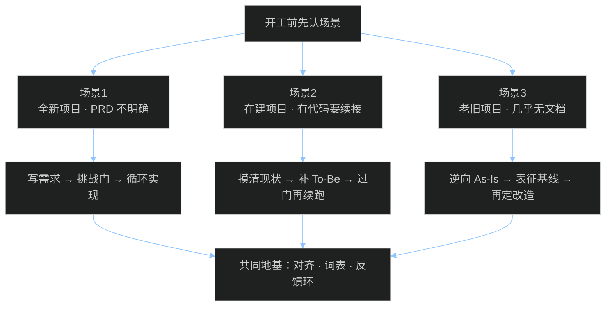

# 一期大纲 · 三个真实开工场景

> 定位：**场景分享 + 讨论**，不是背技能名。  
> 主线：你手头是什么状态 → 最容易踩什么坑 → 这套方法论怎么接 → 讨论题。

## 分享逻辑（先讲清）

---

## 开场：先认场景，再谈提效

多数失败不是「模型不够聪明」，而是：

- 把**还不明确的需求**直接丢给 AI 写代码  
- 把**已有代码**当成白板重写  
- 把**没有文档的老系统**当成「读一遍就能改」

今天用三个开工场景把路径钉死。

---

## 场景 1：全新项目，PRD 还不明确

### 手头状态

- 有想法 / 口头需求 / 一页粗糙说明  
- **还没有**能让 AI 直接落地的模块化 PRD  
- 仓库可能是空的，或只有脚手架

### 常见错误

1. 「帮我把这个功能全做完」→ 范围膨胀、做的不是你想要的  
2. 一口气写超长 PRD，不经挑战就开写 → 歧义进代码  
3. 没有项目共同语言 → AI 说话又长又飘

### 推荐路径

| 步骤 | 做什么 | 关键产物 |
| ---- | ------ | -------- |
| 1 | 拷问并对齐（含领域词） | `CONTEXT.md`、关键决策 |
| 2 | 合成模块化需求 | `docs/prd/00-macro-shared.md` + `modules/` |
| 3 | 成品挑战（挑战门） | `grill-signoff.md` = approved |
| 4 | 拆任务 + 小步实现 | 计划勾选 + 测试先行 |

对应编排：`/prd-author` → `/prd-grill` → `/prd-build-loop`  
底层纪律：拷问原语、领域建模、写成规格、测试驱动。

### 讨论题

- 你最近一个「想法很新」的需求，卡在哪一层：目标不清、边界不清，还是验收不清？  
- 如果只能多做一件事再让 AI 写码，你选：**拷问对齐** 还是 **先写测试**？为什么？

---

## 场景 2：在建项目，已有部分功能与存量代码

### 手头状态

- 已经开发过一部分功能  
- 有存量代码，可能还有零散文档 / 半成品 PRD  
- 目标是**续接**：补功能、改行为、扩模块——不是从零重做

### 常见错误

1. 假装白板，让 AI「按新需求重写」→ 踩坏已上线行为  
2. 只补几句新需求就开写 → 新旧边界对不齐  
3. 没有「已实现 / 未实现」清单 → 重复造轮子或漏改

### 推荐路径

| 步骤 | 做什么 | 关键产物 |
| ---- | ------ | -------- |
| 1 | 摸清现状：哪些已交付、哪些半成品、代码落在哪 | 现状对照表（可局部 As-Is） |
| 2 | 对**已有行为**钉住反馈（表征测试 / 关键路径手测清单） | 不敢轻易改坏的安全网 |
| 3 | 只为**下一批变更**写清 To-Be（缺口 + 范围） | 模块化 To-Be / 续接计划 |
| 4 | 挑战门 → 再进循环实现 | `grill-signoff` + 续跑 |

要点：

- 续接 ≠ 全量逆向；但**改到的边界**必须说清。  
- 有文档就对齐文档与代码；对不上的以代码 + 测试为准，并记进「未知清单」。  
- Matt 纪律同样适用：对齐、词表、小步、移交。

### 讨论题

- 你们在建项目里，「文档说有、代码没有」或反过来的事，最近一次怎么发现的？  
- 续接时，你更怕：**改坏旧功能**，还是 **新功能接不上**？各自该先补什么产物？

---

## 场景 3：老旧项目改造，缺需求、缺文档

### 手头状态

- 历史系统要重构 / 迁移 / 大改  
- 几乎没有可靠需求说明与文档  
- 行为主要活在代码和人口口相传里

### 常见错误

1. 直接让 AI「重构整个项目」→ 行为漂移，线上事故  
2. 把逆向出来的 **As-Is** 直接当实现 backlog → 把「现状」当成「目标」  
3. 不做忠实度确认就开改 → 改完才发现漏了暗逻辑

### 推荐路径

| 步骤 | 做什么 | 关键产物 |
| ---- | ------ | -------- |
| 1 | 代码考古 + 逆向 | `docs/prd/as-is/`（系统图、模块、债务、未知） |
| 2 | 忠实度签核 | `reverse-signoff.md` |
| 3 | 表征基线（把关键行为钉成测试/清单） | 改造安全网 |
| 4 | 再写 To-Be / 迁移计划（目标态，不是现状） | 改造 backlog |
| 5 | 挑战门 → 循环实现 | 与绿场后半段汇合 |

对应编排：`/prd-reverse` →（表征）→ To-Be → `/prd-grill` → `/prd-build-loop`  
铁律：**As-Is  alone 不能进 build-loop。**

### 讨论题

- 没有文档时，你信任什么：老员工口述、生产日志，还是代码本身？如何交叉验证？  
- 「先表征再改造」会不会太慢？慢在哪、省在哪？

---

## 三条路径对照（收束）

| | 场景 1 新品 | 场景 2 续接 | 场景 3 老改 |
| - | ----------- | ----------- | ----------- |
| 起点 | 模糊想法 | 半成品 + 代码 | 几乎只有代码 |
| 先产出 | 模块化 To-Be PRD | 现状对照 + 下一批 To-Be | As-Is + 忠实度 |
| 过门 | 挑战门 | 挑战门（针对变更） | 逆向签核 + 挑战门 |
| 禁忌 | 跳过对齐直接写码 | 当白板重写 | 把 As-Is 当 backlog |
| 终点 | build-loop | build-loop 续跑 | build-loop（按迁移切片） |

---

## 共同地基（只讲够用的）

无论哪条路，底下都是同一套纪律：

1. **先对齐，再动手**（拷问）  
2. **项目要有共同黑话**（领域词表）  
3. **反馈环是速度上限**（测试驱动 / 表征）  
4. **小技能组合，不丢控制权**（人确认决策）

Matt 提供地基；我们仓库提供三条场景的编排入口。

---

## 带走三句话

1. **先认场景，再选路径**——新品 / 续接 / 老改不是同一套起手式。  
2. **没有过门的 PRD，不配直接进实现。**  
3. **老系统先忠实描述现状，再谈目标态；As-Is ≠ 待办清单。**
